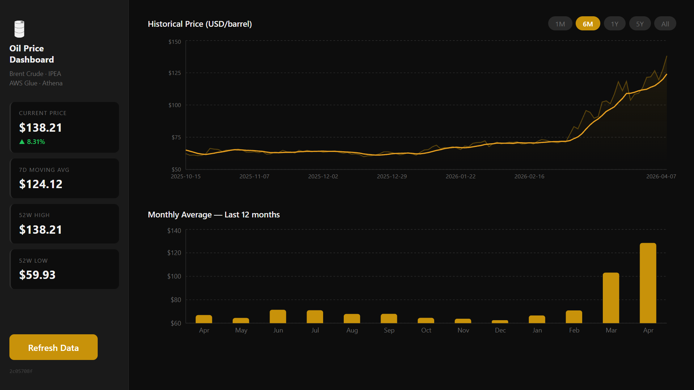

# AWS Oil Lakehouse Pipeline

A serverless batch pipeline that scrapes historical **Brent crude oil prices** from IPEA, processes them with a 7-day moving average via AWS Glue (PySpark), catalogs the result in the Glue Data Catalog, and exposes it through a dark-themed **React + Vite** dashboard backed by Amazon Athena.



Built as FIAP MLET Phase 2 tech challenge.

---

## Architecture

```
IPEA (HTML scraping)
        │
        ▼
AWS Lambda: trigger_pipeline
  · pandas HTML parse
  · Parquet → S3 raw/year=YYYY/
        │
        ▼
AWS Glue Job: oil_price_job  (PySpark 3.3)
  · 7-day moving average (Window.rowsBetween)
  · writes S3 processed/year=YYYY/
  · registers default.oil_price_processed in Glue Catalog
        │
        ▼
Amazon Athena ──── AWS Lambda: get_dashboard_data
                     · S3 JSON cache (cache/dashboard_data.json)
                     · 3 SQL queries: KPIs, series, monthly avg
                          │
                          ▼
                   API Gateway (REST)
                     POST /pipeline/run
                     GET  /pipeline/status/{jobRunId}
                     GET  /dashboard/data
                          │
                          ▼
                   React + Vite Dashboard
                     · localStorage cache (1 h TTL)
                     · recharts line + bar charts
                     · period filters: 1M / 6M / 1Y / 5Y / All
```

---

## Project Structure

```
aws-oil-lakehouse-pipeline/
├── src/
│   ├── backend/
│   │   ├── lambda/
│   │   │   ├── trigger_pipeline.py   # POST /pipeline/run
│   │   │   ├── get_status.py         # GET  /pipeline/status/{id}
│   │   │   └── get_dashboard_data.py # GET  /dashboard/data
│   │   ├── glue/
│   │   │   └── oil_price_job.py      # PySpark ETL job
│   │   └── requirements.txt          # requests==2.31.0 (layer)
│   └── frontend/
│       ├── src/
│       │   ├── App.tsx               # sidebar layout + polling logic
│       │   ├── components/           # KpiRow, PriceChart, MonthlyBarChart, RefreshButton
│       │   ├── services/
│       │   │   └── pipelineService.ts
│       │   ├── types.ts
│       │   └── theme.ts              # dark oil color palette
│       ├── .env.example
│       └── vite.config.ts
├── docs/
│   ├── aws-setup-guide.md            # step-by-step AWS deployment guide
│   ├── lambda-vs-flask-analysis.md   # architectural decision record
│   └── report.md                     # full technical report
└── architecture/
    └── architecture_diagram.png      # (generated)
```

---

## API Endpoints

| Method   | Path                            | Description                                                                         |
| -------- | ------------------------------- | ----------------------------------------------------------------------------------- |
| `POST` | `/pipeline/run`               | Scrape IPEA → write raw Parquet to S3 → start Glue job. Returns `{ jobRunId }`. |
| `GET`  | `/pipeline/status/{jobRunId}` | Poll Glue job state. Returns `{ status: "RUNNING" \| "SUCCEEDED" \| "FAILED" }`.    |
| `GET`  | `/dashboard/data`             | Return KPIs + full series + monthly averages. S3-cached.                            |

---

## Dashboard Response Schema

```json
{
  "kpis": {
    "currentPrice": 72.40,
    "deltaPercent": -1.23,
    "ma7d": 71.85,
    "high52w": 92.10,
    "low52w": 59.93
  },
  "series": [
    { "date": "1987-05-20", "price_usd": 18.63, "moving_avg_7d": null },
    { "date": "1987-05-28", "price_usd": 18.60, "moving_avg_7d": 18.58 }
  ],
  "monthlyAvg": [
    { "month": "2024-05", "avg": 83.21 }
  ],
  "queryId": "0b6dd16d-da4b-467d-9c23-0c10bd533dde"
}
```

---

## Caching Strategy

| Layer   | Mechanism                                   | TTL                           |
| ------- | ------------------------------------------- | ----------------------------- |
| Browser | `localStorage` (key `oil_dashboard_v1`) | 1 hour                        |
| Backend | S3 object `cache/dashboard_data.json`     | Until next Glue `SUCCEEDED` |

On load the app checks localStorage first (instant), then fetches from the API in background. If no data exists anywhere, the pipeline is auto-triggered.

---

## AWS Setup

- S3 bucket creation
- Lambda Layers (`AWSSDKPandas-Python311` + custom `oil-price-extras-layer` for the external requests)
- Lambda function configuration (env vars, IAM roles, timeouts)
- Glue job configuration (job parameters, IAM role)
- API Gateway REST API (resources, methods, CORS, deployment)
- Athena workgroup setup

---

## Frontend Setup

```bash
cd src/frontend
cp .env.example .env
# edit .env → set VITE_API_BASE_URL to your API Gateway invoke URL
npm install
npm run dev
```

---

## Key Design Decisions

- **Lambda over Flask** — Glue jobs run infrequently; serverless eliminates idle cost.
- **Yearly S3 partitions for raw layer** — Reduced S3 `PutObject` calls from ~10 000 (one per day) to ~40 (one per year), keeping the Lambda well within API Gateway's 29 s timeout.
- **`AWSSDKPandas-Python311` AWS layer** — Official managed layer provides pandas + pyarrow + numpy without the 262 MB unzipped size limit problem.
- **`boto3` + `io.BytesIO` instead of `s3fs`** — Eliminates heavy async dependencies and Python version incompatibility when building layers in CloudShell.
- **S3 cache invalidated on Glue `SUCCEEDED`** — `get_status` deletes `cache/dashboard_data.json` when the job completes, ensuring the next dashboard request fetches fresh Athena results.
